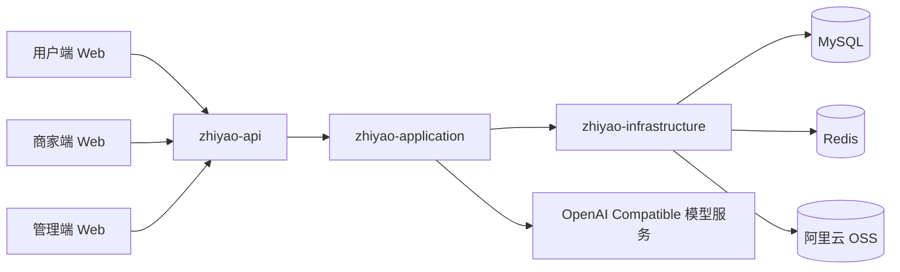
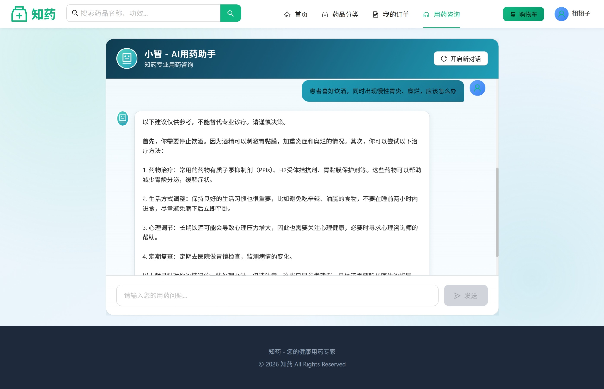
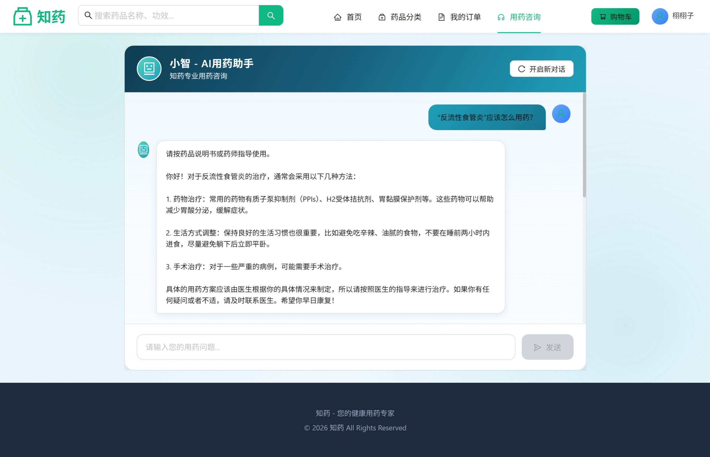

# Zhiyao smart medicine platform（智能医药电商平台）

> 面向用户、商家与平台管理三类角色的多端医药服务平台，当前项目已实现 AI 问诊、药品浏览与下单、订单状态流转、商家药品管理、后台审核与平台配置等核心能力。

## 📖 项目概览 (Overview)

本项目采用前后端分离架构，前端由用户端、商家端、管理端三个 React + TypeScript 应用组成，后端基于 Spring Boot 3 + MyBatis-Plus 的多模块结构实现业务编排、数据访问与基础设施集成。

从业务数据流向看，三端页面通过 HTTP API 调用后端服务，后端在 `zhiyao-api -> zhiyao-application -> zhiyao-infrastructure` 链路中完成业务处理，并与 MySQL、Redis、阿里云 OSS 及 OpenAI Compatible 模型服务交互，最终将结果返回前端页面进行展示。

<div align="center">
  
  <br/>
  <small><i>🎬 智药平台整体效果演示</i></small>
</div>

## ✨ 当前工程亮点 (Highlights)

- **多端协同架构**：同一套后端服务支撑用户端、商家端、管理端三类业务角色，覆盖药品浏览、下单、商家处理、平台审核等主要链路。
- **AI 问诊能力接入**：后端通过 OpenAI Compatible 接口对接 Qwen 模型服务，并在应用层实现问诊、历史会话和模型调用封装。
- **订单链路具备并发防护基础**：下单流程使用事务控制，并通过原子 SQL 扣减库存，降低并发场景下的超卖风险。
- **缓存与配置能力已接入**：项目已集成 Redis，当前主要用于平台配置与管理员资料缓存。
- **文件上传链路可用**：后端已接入阿里云 OSS，用于图片等文件资源上传。
- **接口调试与鉴权基础完善**：项目集成 Knife4j API 文档与 JWT 无状态认证，便于接口联调与多角色鉴权。

## 🏗 系统架构 (Architecture)



## 🚀 核心功能 (Core Features)

### 👨‍⚕️ 用户端 (Customer Web)

- **AI 智能问诊**：基于 Qwen2.5 系列模型服务实现医药咨询问答，并保留历史会话能力。
- **医药商城**：支持药品搜索、分类浏览、药品详情查看、收藏、购物车与下单。
- **订单管理**：支持订单列表、订单详情、订单状态查询与收货确认。
- **个人中心**：支持账户信息、收货地址、收藏列表与基础设置管理。

### 🏪 商家端 (Merchant Dashboard)

- **药品管理**：支持药品新增、编辑、上下架与基础库存维护。
- **订单处理**：支持订单列表查看、订单详情查看、接单与履约状态处理。
- **店铺设置**：支持门店信息、营业时间、头像等资料维护。
- **经营概览**：首页聚合店铺经营与待处理数据。

### 🛠 管理端 (Admin Panel)

- **用户与骑手管理**：支持后台查看和管理平台用户、骑手数据。
- **商家审核**：支持商家入驻资料查看与审核。
- **药品审核与管理**：支持药品查看、分类调整、审核与状态维护。
- **订单管理与平台配置**：支持后台订单查询，以及平台基础配置维护。

## 🛠 技术栈 (Tech Stack)

### Backend

- **核心框架**：Java 17, Spring Boot 3
- **分层结构**：`zhiyao-api` / `zhiyao-application` / `zhiyao-domain` / `zhiyao-infrastructure`
- **数据访问**：MyBatis-Plus, MySQL 8
- **缓存能力**：Redis
- **鉴权能力**：Spring Security, JWT
- **接口文档**：Knife4j / OpenAPI 3
- **文件存储**：阿里云 OSS

### Frontend

- **前端框架**：React 18, TypeScript, Vite
- **路由与请求**：React Router, Axios
- **状态管理**：Zustand
- **UI 组件**：Ant Design, Ant Design Pro Components, Ant Design Charts

### AI & Model Serving

- **模型接入方式**：OpenAI Compatible Chat Completions API
- **模型配置**：支持远端 Qwen2.5-3B SFT，也支持本地 Ollama 调试
- **增强策略**：RAG、Prompt Engineering、风险约束

## 🧠 模型微调与安全增强 (Qwen2.5-1.5B LoRA)

1. **LoRA 微调与评测闭环**：基于 Qwen2.5-1.5B 构建“数据清洗 + 指令重构 + 检索增强”的训练体系，并设计评测闭环；针对医疗高风险问答优化模型幻觉，使幻觉率由 100% 降至 53.5%（内部下降 65.0%，外部下降 30.4%），显著提升模型输出可靠性。
2. **风险识别与分级约束**：在推理阶段引入风险识别与分级约束机制，通过拒答控制与人工兜底限制高风险输出，实现医疗场景下的可控生成与安全边界约束。
3. **医药垂直 RAG Pipeline**：构建分块、向量化、检索增强的一体化 RAG 流程，并结合 Prompt 约束注入证据片段，提升回答的事实一致性与可解释性。

### 🧠 模型服务接入（推荐远端 Qwen2.5-1.5B SFT）

* 推荐使用远端微调服务（OpenAI Compatible）：
    * `base-url`: `http://<server-ip>:8001`
    * `chat-path`: `/v1/chat/completions`
    * `model`: `qwen2.5-1.5b-medical-sft`
* 可选本地 Ollama 方案（开发调试）：
    * 安装 Ollama: https://ollama.com
    * 下载模型: `ollama pull qwen2.5:0.5b`
    * 启动服务: `ollama serve qwen2.5:0.5b --device cpu --threads 4`


## 🧩 关键实现点 (Implementation Notes)

- **AI 问诊服务接入**：后端通过 OpenAI Compatible API 与模型服务通信，在应用层封装请求构建、历史消息组装与回答解析逻辑。
- **下单与库存控制**：订单创建流程由事务统一管理，药品库存扣减采用原子 SQL，避免基于旧库存值重复扣减。
- **订单状态流转**：订单状态在用户、商家、骑手不同操作下逐步推进，由后端统一维护状态字段与时间节点。
- **平台配置缓存**：Redis 当前主要承载后台平台配置与管理员资料缓存，降低高频读取场景下的数据库访问。
- **文件上传链路**：上传接口通过 OSS 服务封装完成文件写入与访问地址返回。

## ✅ 当前质量保障 (Quality Status)

- **单元测试**：当前仓库已包含针对订单服务的聚焦单元测试，用于验证原子扣库存失败时不会写入脏订单数据。
- **接口联调基础**：后端提供 Knife4j API 文档，便于多端联调与接口验证。
- **运行状态确认**：后端提供基础健康检查接口，并在核心业务链路中输出日志辅助排查。


## 🖼️项目实现图 (Project Implementation Diagram)

下面按“功能说明 -> 对应截图”的方式展示项目实现效果，每个功能先用一句话从技术实现与数据流向角度做简述，再展示 1 到 3 张对应页面截图。

### AI 用药助手

用户输入症状后，前端将问题发送到后端，后端结合 Qwen2.5 LoRA、RAG 检索增强和风险约束生成回答，再把结果返回页面展示。

<div style="display: flex; flex-wrap: wrap;">
    
    
</div>

### 用户端首页与商城入口

用户进入首页后，前端请求首页推荐、分类入口和商城聚合数据，后端完成查询后返回页面做首屏渲染与导航分发。

<div style="display: flex; flex-wrap: wrap;">
    
    
</div>

### 用户端药品检索与列表浏览

用户输入关键词或切换分类后，前端调用药品查询接口，后端按条件检索数据库并分页返回列表结果给页面展示。

<div style="display: flex; flex-wrap: wrap;">
    
    
    
</div>

### 用户端药品详情与收藏加购

用户进入药品详情页后，前端加载药品详情数据，并将收藏、加购等操作同步到本地状态或后端业务接口。

<div style="display: flex; flex-wrap: wrap;">
    
    
    
</div>

### 用户端收藏状态交互

用户对药品执行收藏或取消收藏时，前端先更新交互状态，再通过接口与后端收藏记录保持一致。

<div style="display: flex; flex-wrap: wrap;">
    
    
</div>

### 用户端购物车与下单

购物车数据先在前端维护，提交订单时再将勾选商品、数量和收货信息组装后发送给后端生成订单。

<div style="display: flex; flex-wrap: wrap;">
    
    
</div>

### 用户端订单追踪

用户进入订单列表或订单详情页时，前端调用订单查询接口，后端返回最新状态、商品明细和时间节点供页面展示。

<div style="display: flex; flex-wrap: wrap;">
    
    
</div>

### 用户端个人中心

个人中心页面统一拉取用户资料、地址和账户相关信息，并在前端做分块展示与入口聚合。

<div style="display: flex; flex-wrap: wrap;">
    
    
    
</div>

### 用户端智能问诊页面

聊天页面负责承接用户输入、上下文消息和模型回复内容，形成从提问到结果展示的完整问诊交互链路。

<div style="display: flex; flex-wrap: wrap;">
    
    
</div>

### 商家端首页与经营概览

商家端首页聚合店铺经营数据和待处理事项，前端加载概览接口后展示核心经营入口和状态信息。

<div style="display: flex; flex-wrap: wrap;">
    
</div>

### 商家端药品管理

商家通过药品管理页面维护商品信息，前端提交新增或编辑表单后，由后端写入药品表并更新库存和状态。

<div style="display: flex; flex-wrap: wrap;">
    
    
</div>

### 商家端订单处理

商家进入订单列表和详情页后，通过后端订单接口完成接单、查看明细和履约状态处理。

<div style="display: flex; flex-wrap: wrap;">
    
    
</div>

### 商家端店铺信息与设置

店铺基础信息和经营配置由商家端页面统一维护，提交后由后端更新门店资料并返回最新展示结果。

<div style="display: flex; flex-wrap: wrap;">
    
    
</div>

### 管理端首页与平台总览

管理端首页汇总平台用户、商家、订单等核心指标，前端通过后台统计接口获取数据后做总览展示。

<div style="display: flex; flex-wrap: wrap;">
    
</div>

### 管理端用户与骑手管理

管理员通过后台查询接口拉取用户和骑手数据，并在页面完成状态查看、审核与基础管理操作。

<div style="display: flex; flex-wrap: wrap;">
    
    
</div>

### 管理端商家审核

管理员查看商家入驻信息后发起审核请求，后端更新商家审核状态并回传最新结果给管理页面。

<div style="display: flex; flex-wrap: wrap;">
    
    
</div>

### 管理端药品审核与管理

管理员通过药品管理模块查看、审核和维护药品数据，后端同步更新药品分类、审核状态和展示状态。

<div style="display: flex; flex-wrap: wrap;">
    
    
    
</div>

### 管理端订单管理

后台订单管理页通过订单查询接口获取平台订单数据，并支持按状态查看订单详情和运营处理进度。

<div style="display: flex; flex-wrap: wrap;">
    
    
</div>


## 📂 项目结构 (Project Structure)

```
Zhiyao-System/
├── zhiyao-backend/                # 后端工程 (Maven 多模块)
│   ├── zhiyao-api                # 启动入口、Controller、全局配置
│   ├── zhiyao-application        # 应用服务、业务编排
│   ├── zhiyao-common             # 通用枚举、返回体、异常定义
│   ├── zhiyao-domain             # 领域对象与领域能力
│   ├── zhiyao-infrastructure     # 持久层、缓存、鉴权、OSS 等基础设施
│   └── ...
├── frontend/               # 前端工程
│   ├── zhiyao-web-user           # 用户端
│   ├── zhiyao-web-merchant       # 商家端
│   └── zhiyao-web-admin          # 管理端
├── Qwen_sft/                # 模型微调与相关资料
└── docs/                   # 项目文档与 SQL 脚本
```

## ⚡️ 快速开始 (Quick Start)

### 1. 环境准备
*   JDK 17+
*   Node.js 18+ & npm
*   MySQL 8.0
*   Redis

### 2. 后端启动
```bash
cd zhiyao-backend
mvn -pl zhiyao-api -am clean package -DskipTests
java -jar zhiyao-api/target/zhiyao-api-1.0.0.jar
```
*   服务端口: `8081`
*   API 文档: `http://localhost:8081/api/doc.html`

### 3. 前端启动
```bash
# 用户端
cd frontend/zhiyao-web-user
npm install
npm run dev

# 新开终端启动商家端
cd frontend/zhiyao-web-merchant
npm install
npm run dev

# 新开终端启动管理端
cd frontend/zhiyao-web-admin
npm install
npm run dev
```

## 🚀 部署指南 (Deployment)

### 1. 生产环境配置 (Environment Variables)
当前项目已在 `application.yml` 中支持部分 AI 相关环境变量覆盖；数据库、Redis、OSS 等配置目前仍以配置文件为主，生产环境建议进一步改造为环境变量或配置中心方式管理。

| 变量名 | 描述 | 默认值/示例 |
| :--- | :--- | :--- |
| `AI_BASE_URL` | 模型服务基地址 | `http://<server-ip>:8001` |
| `AI_MODEL` | 模型名称 | `qwen2.5-1.5b-medical-sft` |
| `AI_CHAT_PATH` | Chat Completions 路径 | `/v1/chat/completions` |
| `AI_API_KEY` | 模型服务 API Key | `sk-...` |

### 2. 后端部署 (Backend)
1.  **打包**: 在 `zhiyao-backend` 目录下运行 `mvn -pl zhiyao-api -am clean package -DskipTests`。
2.  **产物**: 获取 `zhiyao-backend/zhiyao-api/target/zhiyao-api-1.0.0.jar`。
3.  **运行**: 上传到服务器，使用命令启动：
    ```bash
    java -jar -Dspring.profiles.active=prod zhiyao-api-1.0.0.jar
    ```

### 3. 前端部署 (Frontend)
1.  **构建**: 分别在 `frontend/zhiyao-web-user`、`frontend/zhiyao-web-merchant`、`frontend/zhiyao-web-admin` 目录下运行 `npm install && npm run build`。
2.  **产物**: 
    *   用户端: `frontend/zhiyao-web-user/dist/`
    *   商家端: `frontend/zhiyao-web-merchant/dist/`
    *   管理端: `frontend/zhiyao-web-admin/dist/`
3.  **托管**: 将生成的静态文件上传到 Nginx/宝塔网站目录即可。


## 📝 许可证
本项目采用 MIT 许可证：[LICENSE](https://github.com/WillingXu1/Zhiyao-smart-medicine-platform/blob/008818400c012259af068aafdc22d994bbf42eef/LICENSE)


## 贡献指南

欢迎提交 PR 或 Issue 来优化本项目。

如有问题，欢迎通过邮箱与我联系交流，项目仍在持续完善中，也欢迎继续提出建议。

> **作者**: zxs
> **邮箱**: 2571293150@qq.com  
> **GitHub**: [[Zhiyao]](https://github.com/WillingXu1/Zhiyao-smart-medicine-platform.git)
